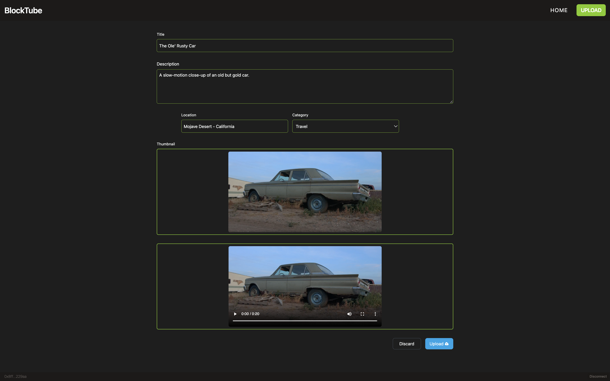
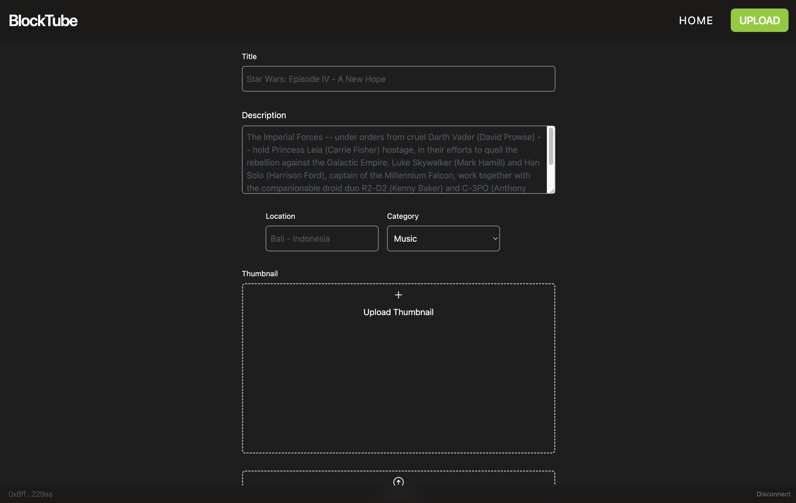
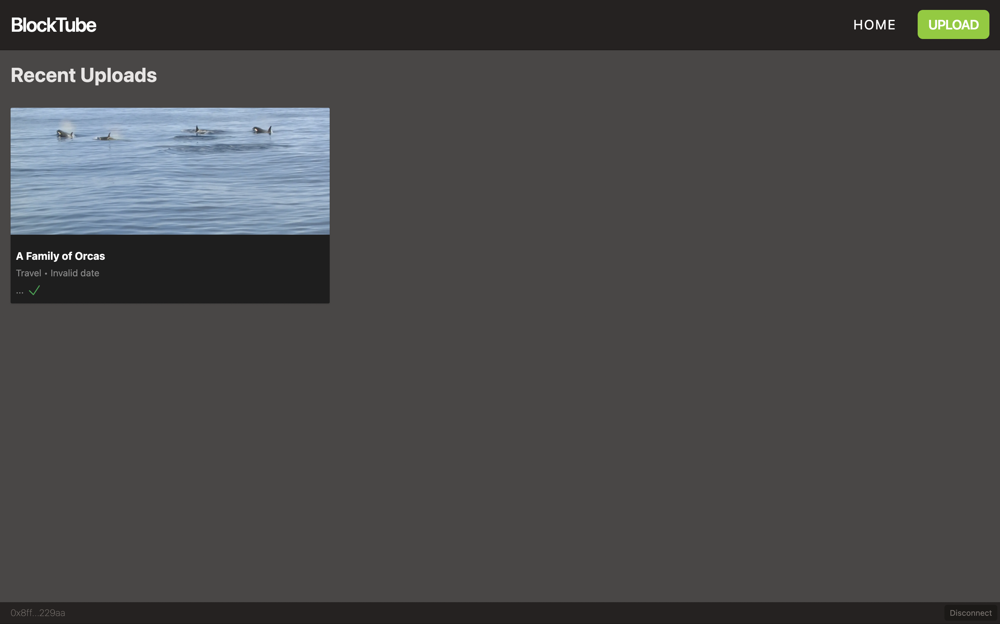
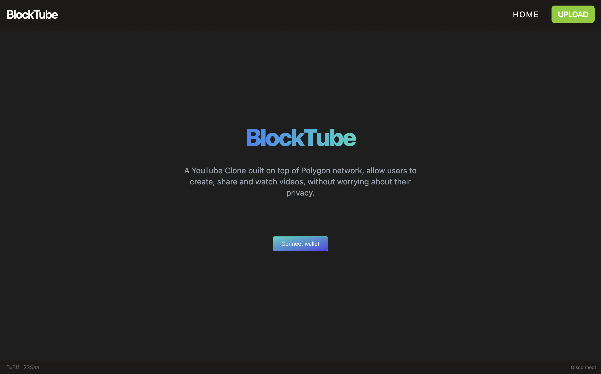

# 🎞 Blocktube

## A Web3 Youtube Clone

> 🌐 UPLOAD VIDEO - Connect your externally owned crypto address to this dApp to upload (mint) videos to a dedicated smart contract on Polygon. The videos you upload as NFT's will be soon able to be traded and auctioned.

> 🎥 WATCH VIDEO - View video NFTs that other people minted thanks to the public nature of blockchain technology.

### 
### 
### 
### 

---
## 📦 Clone this dApp

> clone/fork 🎞 Blocktube:

```bash
git clone https://github.com/pryority/web3-youtube.git
```